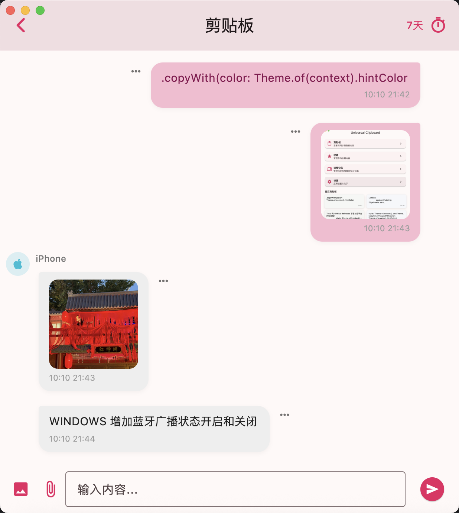
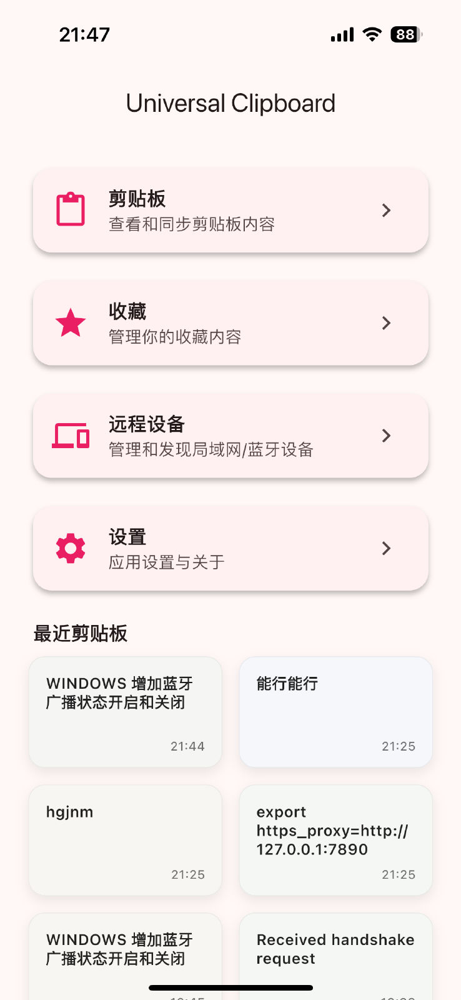

# UniClip

一款跨设备剪贴板同步工具，支持局域网与蓝牙双通道，同步文本/图片等内容。开箱即用、无云端依赖，数据仅在你的设备之间本地传输与保存。

## 功能特性
- 局域网 (TCP) + 蓝牙 (BLE) 双通道同步
- 当在同一局域网时使用 TCP，无法直连时回落到低功耗蓝牙
- 跨平台支持：Android、iOS、Windows、macOS、Linux
- 文本与图片同步（图片按 PNG/JPEG 自动识别）
- 历史记录管理，支持保留天数配置与一键清理过期记录
- APP 键盘扩展：无需切出当前 App，可直接从历史粘贴
- 完全本地化：不依赖任何云服务，不采集任何数据

## 下载地址

- Windows 版：[下载桌面端](releases/latest/uniclip-windows-setup.exe)
- macOS 版：[下载桌面端](releases/latest/uniclip-macos.dmg)
- Android 版：[下载移动端](releases/latest/uniclip-android.apk)
- iOS 版：[下载移动端](https://testflight.apple.com/join/rx3ZQh3z)

> 如有新版本或其他平台支持，请关注项目主页或后续更新。

## 数据与隐私

详见 [PRIVACY.md](PRIVACY.md)

## 软件截图

